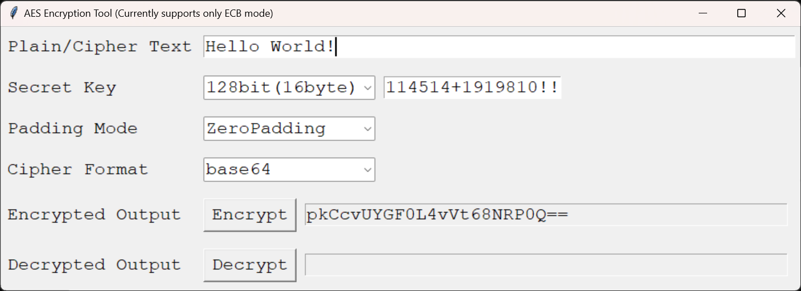

# Minimal Implementation of AES-ECB in Python for Windows

[\[English\]](https://github.com/SanJerry007/AES-ECB-Minimal-Windows/tree/main/README-en.md)  |  [\[中文\]](https://github.com/SanJerry007/AES-ECB-Minimal-Windows/tree/main/README.md)

A simple and minimal implementation of the AES-ECB encryption and decryption algorithm in Python, including an executable file with a visual interface for direct use on Windows systems.

## Usage

If you are using the Windows system, directly run the executable file `./EN/AES-ECB-Tool.exe`.

If you want to modify the code by yourself, first you should install the dependency:

```shell
pip install crypto
```

Then you can feel free to change the code in `./EN/AES-ECB-Tool.py` as per your requirements.

To pack a Python script into a portable `.exe` file, I suggest using the [PyInstaller](https://pyinstaller.org/en/stable/):

```shell
pip install pyinstaller
pyinstaller ./EN/AES-ECB-Tool.py --onefile
```

Then the executable will be generated to `./dist/AES-ECB-Tool.exe`.

## Supported Functions

- Basic AES-ECB Encryption & Decryption Algorithm
- Visual Interface for Windows
- Variable Secret Key Length:
  - 128bit (16byte)
  - 192bit (24byte)
  - 256bit (32byte)
- Various Padding Methods: 
  - ZeroPadding
  - PKCS7
  - AnsiX923
  - ISO10126
  - ISO97971
- Multiple Cipher Formats:
  - Base64
  - Hex


