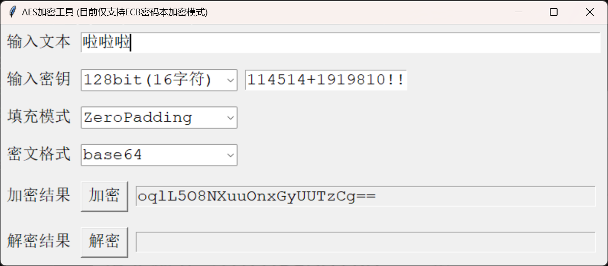

# AES-ECB加密算法最小化实现

[\[English\]](https://github.com/SanJerry007/AES-ECB-Minimal-Windows/tree/main/README-en.md)  |  [\[中文\]](https://github.com/SanJerry007/AES-ECB-Minimal-Windows/tree/main/README.md)

最小化的AES-ECB加密解密算法实现(Python)，同时提供了在Windows下运行的exe文件。

## 用法

在Windows系统下的话，直接运行 `./CN/AES-ECB加密解密工具.exe` 就可以。

如果你要自己改代码，记得先安装依赖:

```shell
pip install crypto
```

然后就可以随便魔改 `./CN/AES-ECB加密解密工具.py` 里的东西了。

如果你想打包修改后的代码为一个 `.exe` 文件, 可以使用 [PyInstaller](https://pyinstaller.org/en/stable/) 工具:

```shell
pip install pyinstaller
pyinstaller ./EN/AES-ECB-Tool.py --onefile
```

之后你应该就可以在 `./dist/AES-ECB加密解密工具.exe` 找到可执行文件了。

## 支持功能

- 基础的 AES-EBC 加密解密算法
- Windows 下的可视化操作界面
- 支持不同长度的密钥:
  - 128bit (16字符)
  - 192bit (24字符)
  - 256bit (32字符)
- 支持不同的填充方法: 
  - ZeroPadding
  - PKCS7
  - AnsiX923
  - ISO10126
  - ISO97971
- 支持多种密文格式:
  - Base64
  - Hex

